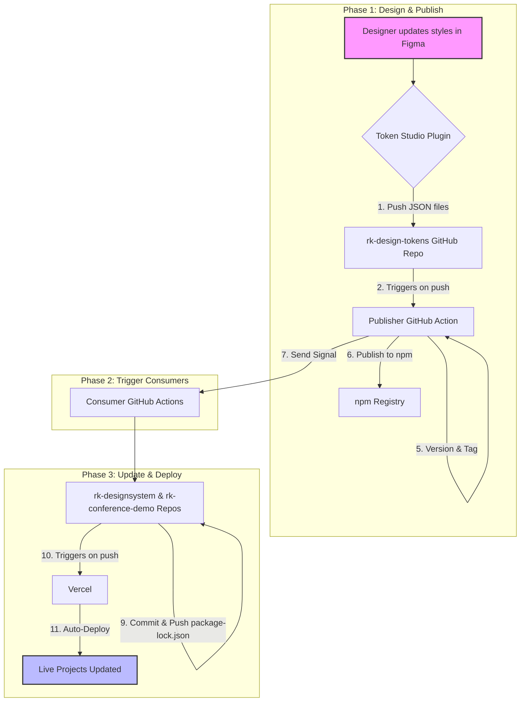

# Røde Kors Design Tokens

This repository is the central source for all design tokens (colors, typography, spacing, etc.) for the Norwegian Red Cross's digital products. It acts as a single source of truth that automatically distributes style changes to all connected projects.

## End-to-End Design Token Automation Workflow

### Brief Explanation

This workflow establishes a fully automated pipeline that connects our design process directly to our live production applications.

When a designer updates the brand style in Figma, this system automatically builds, versions, and publishes a new style package to npm. It then signals our Vercel projects (`rk-designsystem` and `rk-conference-demo`), which automatically update themselves and redeploy with the new styles.

The result is perfect brand consistency, dramatically increased development speed, and the empowerment of designers to make visual updates without needing a developer to manually intervene.

### Flowchart

### The Process in Detail

#### Phase 1: A Designer Makes a Change (The "Publisher")

This phase occurs within the `rk-design-tokens` repository.

1.  **Design in Figma:** A designer makes a change to a color, font, or any other design token.
2.  **Push to GitHub:** Using the **Token Studio** plugin, the designer pushes the changes. This automatically commits the updated JSON files to the `main` branch of `rk-design-tokens`.
3.  **Trigger the Publisher Workflow:** This push instantly triggers the GitHub Action defined in `.github/workflows/publish.yml`.
4.  **Build & Commit Artifacts:** The workflow runs `npm run build`, which converts the JSON files into a finished `design-tokens-build/` folder with CSS. It then commits this newly generated folder to the repository.
5.  **Versioning & Release:** With the build artifacts committed, the workflow runs `npm version patch`. This automatically increases the version number in `package.json` (e.g., from `1.0.8` to `1.0.9`), creates a new "release" commit, and tags it.
6.  **Publish to npm:** Finally, the workflow pushes both new commits and the tag to GitHub, and publishes the new version of the `rk-design-tokens` package to the npm registry.

#### Phase 2: Notifying the Applications (The "Signal")

7.  **Send a Dispatch Signal:** After a successful publish, the final step of the workflow sends a `repository_dispatch` signal to both the `rk-designsystem` and `rk-conference-demo` repositories. This is like ringing a doorbell to tell them a new version is ready.

#### Phase 3: Automatic Update and Redeployment (The "Consumers")

This phase runs in parallel for both of your Vercel projects.

8.  **Trigger the Consumer Workflow:** The `repository_dispatch` signal is received, which starts the "Update Design Tokens and Redeploy" workflow in each of the consumer projects.
9.  **Update Dependencies:** The workflow runs `npm update rk-design-tokens`, which fetches the latest version from npm and updates the project's `package.json` and `package-lock.json` files.
10. **Commit & Push the Update:** The workflow commits these updated files back to the `main` branch with a message like "chore(deps): update rk-design-tokens to latest".
11. **Vercel Auto-Deploys:** Vercel's Git integration is continuously monitoring the `main` branch. It sees this new commit from the bot and automatically starts a brand new build and deployment of the application.

Within minutes of the designer pushing a change in Figma, both live websites are updated with the new styles, completing the fully automated, end-to-end cycle.